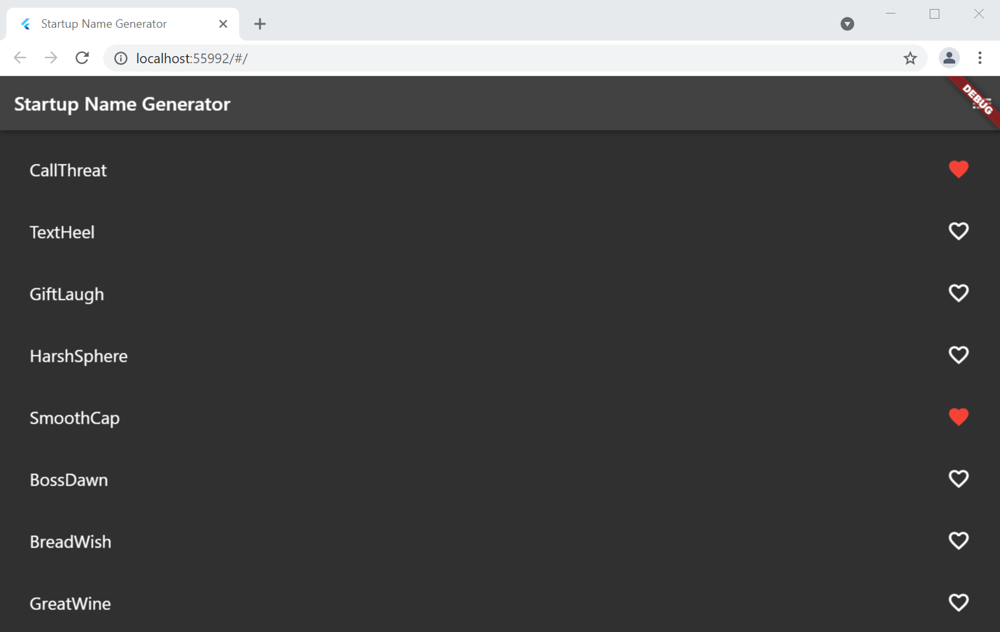
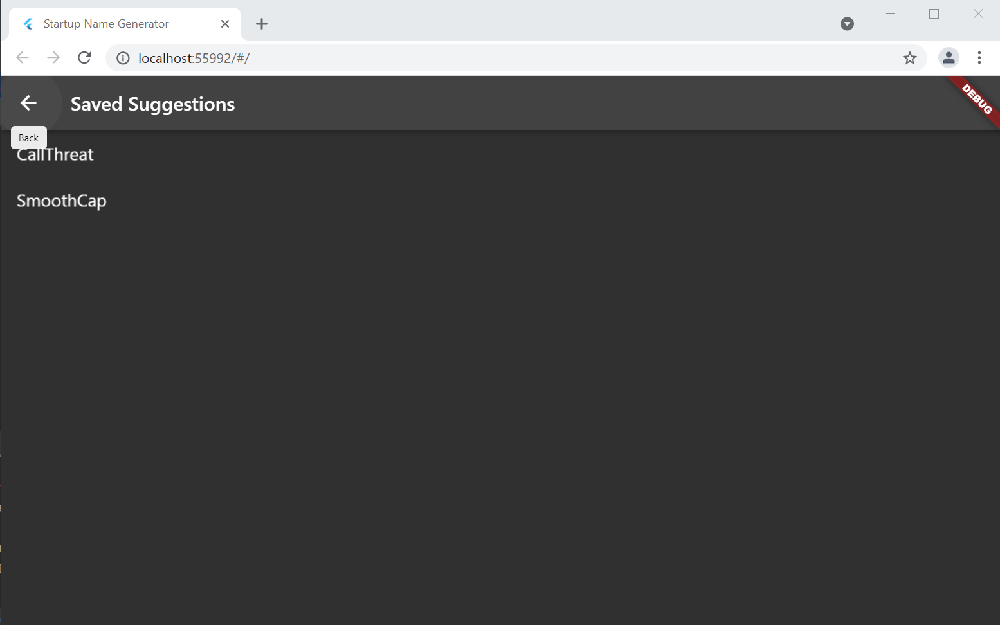

# Intro to [Flutter](https://flutter.dev/) Part 2

## What you built? 

To continue working with Flutter, I followed the "part 2" of Google's intro Flutter tutorial.
In this tutorial, I added a "like" functionality to the startup names and added a route to see the
liked names on their own screen. I also updated the design a bit.
The main code is in lib/main.dart.
Below is a screenshot of the app as a Chrome web app:

## Who Did What?

I followed this tutorial on my own.

## What you learned

### What worked

* Since I already had everything installed, I enjoyed this hacktivity a lot more because I got to spend more time coding
* Like any coding language, practice makes perfect. Second time around, I already felt a little more comfortable working in Dart
* I actually tested cross platform this time! (Android and Web) It is impressive the way the apps mimic the native platform's "vibe" (for lack of a better word)

### What didn't work

* I don't really like the way Flutter organizes its theme/design hierarchy--the way code takes precedence is strange and not intuitive
  (I assume this is the cost of app looking "natural" cross platform)
* I tried to change the code such that it loaded suggestions from a list I have on my phone of
potential band names (it's very long, been adding to it for years). [Here](https://github.com/dartmouth-cs98/hack-a-thing-21f-1-laurel-dernbach/tree/bandnames-trial) is the attempt
(I accidentally created this branch off the wrong remote), based on [this](https://toastguyz.com/flutter/read-and-write-files-in-flutter) blog post.
I ultimately couldn't get it to work because I was having trouble matching types / handling null returns.
I don't think I completely understand how state persists within this SDK so I would definitely have to continue practicing if this is a technology I want to use for a project.

## Authors

Laurel Dernbach (see Acknowledgments for tutorial information)

## Acknowledgments

I followed [this](https://codelabs.developers.google.com/codelabs/first-flutter-app-pt2/#0)
tutorial to build this app, which includes most of the source code.

